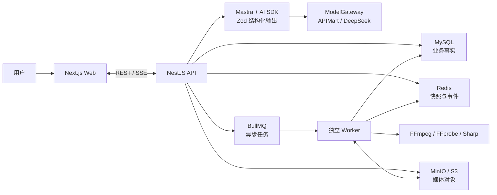

<div align="center">

# Chat-to-Video

### 从一句自然语言，到可审核、可恢复、可追溯的电影化视频生产流水线

*From conversation to a reviewable, resumable, and traceable cinematic production pipeline.*

<p>
  
  
  
  
  
</p>

Chat-to-Video is a TypeScript monorepo for turning natural-language conversations into cinematic videos. It combines deterministic Mastra workflows, human approval checkpoints, BullMQ-based media jobs, resumable SSE progress, and FFmpeg composition behind a modular NestJS API.

</div>

> [!IMPORTANT]
> 本项目处于 **Engineering Preview** 阶段，适合架构验证和本地体验，尚未面向生产环境开放。模型调用会产生第三方服务费用，请在运行生成任务前确认账户额度。

## 项目概览

Chat-to-Video 将聊天、创作决策与异步媒体生产整合为一条确定性的工作流。用户可以从一句创意开始，在创意方案、脚本、分镜和素材等阶段逐步审核或修改，系统再通过独立 Worker 生成素材、合成视频，并将进度持续推送回浏览器。

它不是在 HTTP 请求中直接运行媒体计算的演示脚本，而是一套面向长耗时 AI 视频任务设计的工程骨架：在线 API、工作流状态、队列执行、对象存储与浏览器体验彼此隔离，并通过共享 Schema 保持边界一致。

## 核心能力

| 能力 | 当前实现 |
| --- | --- |
| 对话式创作入口 | 普通问答与视频生产意图由服务端统一裁决，Web 不维护第二套工作流事实 |
| 确定性电影管线 | Mastra 按统一管线定义推进阶段，Agent 只生成经 Zod 校验的结构化产物 |
| Human-in-the-loop | 创意方案、脚本、分镜与素材规划支持确认和修改；素材生成完成后提供二次审批 |
| 暂停、恢复与重启 | 审批点可暂停和恢复，可从可重启阶段创建新分支并保留 checkpoint 历史 |
| 异步媒体执行 | BullMQ 按资源特征隔离 Agent、图片、渲染和清理任务，Worker 独立于在线 API |
| 可恢复进度流 | SSE 传输 Agent 文本和任务进度，重连后先恢复快照，再补发增量事件 |
| 媒体与对象存储 | FFmpeg、FFprobe 与 Sharp 负责安全的媒体处理，MinIO/S3 保存素材和成片 |
| 全栈类型边界 | Web、API 与 Worker 复用 `@chat-to-video/contracts` 中的 Zod Schema 和推导类型 |

## 从对话到成片

```text
自然语言输入
   ↓
创作研究 → 创意方案（审核）→ 脚本（审核）→ 分镜写作（审核）
   ↓
素材规划（审核）→ 异步素材生成 → 素材结果（再次审核）
   ↓
剪辑方案 → FFmpeg 合成 → MinIO/S3 成片 → SSE 完成事件
```

- **审核优先**：付费素材生成和最终合成只在对应审批完成后发生。
- **状态可追溯**：MySQL 保存业务事实、版本和审计记录；Redis 承担队列、短期进度与工作流快照。
- **失败可恢复**：重复请求先复用已持久化产物和既有任务，避免重复调用模型或重复入队。
- **分支不覆盖历史**：阶段重启会创建新的运行分支，旧产物和已完成视频继续以只读历史保留。

## 系统架构



核心部署形态是“模块化单体 NestJS API + 独立 BullMQ Worker + Next.js Web”。耗时媒体计算不会进入 Web 或 API 请求进程；MySQL 是业务事实来源，Redis 和 MinIO/S3 分别承担短期运行状态与媒体二进制。

## 快速开始

### 使用 Docker Compose（推荐）

需要准备：

- Docker 与 Docker Compose
- 可用的 `APIMART_API_KEY`

在仓库根目录创建本地环境文件：

```bash
cp .env.example .env.local
# PowerShell: Copy-Item .env.example .env.local
```

编辑 `.env.local`，至少填写：

```dotenv
APIMART_API_KEY=your-api-key
```

构建并启动 MySQL、Redis、MinIO、数据库迁移、API、Worker 与 Web：

```bash
docker compose --env-file .env.local up --build
```

| 服务 | 地址 |
| --- | --- |
| Web 创作中心 | <http://localhost:4000/studio/agent> |
| API 健康检查 | <http://localhost:4101/health> |
| MinIO Console | <http://localhost:9001> |
| MySQL | `localhost:4002` |
| Redis | `localhost:4003` |

停止服务但保留命名卷数据：

```bash
docker compose down
```

## 本地开发

运行时要求与根配置保持一致：

- Node.js `>=26.7.0 <27`
- pnpm `>=11.20.0 <12`
- FFmpeg 与 FFprobe 可执行文件
- MySQL、Redis 和 MinIO

只使用 pnpm 安装依赖：

```bash
corepack enable
pnpm install
```

可先通过 Compose 启动本地基础设施，再应用数据库迁移：

```bash
docker compose --env-file .env.local up -d mysql redis minio minio-init
pnpm --filter @chat-to-video/database db:migrate
```

分别启动 Web/API 和异步 Worker：

```bash
# Terminal 1: Next.js + NestJS
pnpm dev:chat

# Terminal 2: BullMQ Worker
pnpm --filter @chat-to-video/worker dev
```

国内网络环境可使用带镜像自动选择与官方源兜底的安装命令：

```bash
pnpm deps:install:cn
```

### 常用命令

| 命令 | 用途 |
| --- | --- |
| `pnpm build` | 构建全部 workspace |
| `pnpm lint` | 执行 ESLint 检查 |
| `pnpm typecheck` | 执行 TypeScript 类型检查 |
| `pnpm test` | 运行脚本测试与各 workspace 测试 |
| `pnpm db:seed:history` | 幂等写入对话历史演示数据 |
| `pnpm sdk:docs:ai -- "ToolLoopAgent"` | 搜索当前锁定 AI SDK 版本附带的文档 |

## Monorepo 结构

```text
apps/
├── web/          Next.js 创作中心与浏览器交互
├── api/          NestJS API、Agent、Mastra 工作流与 SSE
└── worker/       BullMQ 任务、模型媒体生成与 FFmpeg 合成

packages/
├── contracts/    跨边界 Zod Schema、DTO、队列与 SSE 协议
├── database/     Drizzle Schema、迁移与数据访问
├── storage/      S3/MinIO 接口与对象键约束
├── media/        FFmpeg、FFprobe、Sharp 安全封装
├── tools/        可复用工具定义与适配能力
└── config/       共享工程配置

infra/            Docker 镜像与基础设施配置
scripts/          安装、启动、文档查询与连通性脚本
docs/             架构决策、实施方案与验证报告
```

## Engineering Preview

当前仓库已经具备端到端工程闭环，但以下边界尚未达到生产可用标准：

- 租户与项目命名空间仍固定为 `tenant/demo/project/demo`，客户端不能指定真实租户或项目。
- APIMart 是受内部 `ModelGateway` 隔离的默认模型网关；工具调用、结构化输出、限流、重试、错误码和用量语义仍需在真实账户上完成完整门禁验证。
- APIMart 视频与素材生成会消耗真实额度，不建议在缺少配额、成本和审计策略时开放给非受信用户。
- 身份认证、资源级授权、生产密钥管理、可观测性和灾备尚未形成完整生产方案。
- `package.json` 当前版本为 `0.0.0`，暂无稳定 API、迁移兼容性或发布节奏承诺。

## 延伸阅读

- [技术架构选型](./docs/架构选型.md) — 系统边界、技术选择与演进路线
- [依赖安装顺序](./docs/依赖安装顺序.md) — workspace 依赖、固定版本与基础设施顺序
- [国内镜像源](./docs/国内镜像源.md) — pnpm 镜像选择、回退机制与使用限制
- [用户意图识别落地](./docs/用户意图识别落地.md) — 审核点自然语言裁决与状态机边界
- [第三方声明](./THIRD_PARTY_NOTICES.md) — OpenMontage 改编范围与第三方归属

## License

本项目采用 [GNU Affero General Public License v3.0](./LICENSE)。使用、修改或部署前，请同时阅读 [THIRD_PARTY_NOTICES.md](./THIRD_PARTY_NOTICES.md)。
